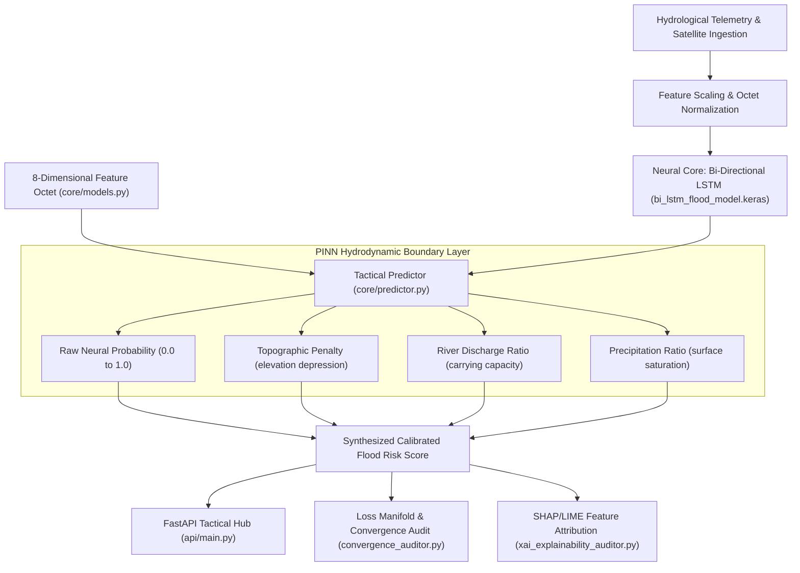

# Sentinel V7: Spatiotemporal Neural Core & PINN Hydrology Engine

[](LICENSE)
[](https://www.python.org/)
[](https://fastapi.tiangolo.com/)
[](https://keras.io/)
[](#explainable-ai)

**Sentinel V7 (HUFP_SENTINEL_V6)** is the deep-learning analytical engine and spatiotemporal neural core of **Project Salsette**. It provides spatiotemporal neural network inference, out-of-distribution (OOD) stress testing, mathematical loss manifold auditing, and explainability extraction for regional flood forecasting and hydrological risk management.

The core predictive engine is a **Bi-Directional LSTM neural network** constrained by **Physics-Informed Neural Network (PINN)** hydrodynamic boundaries. Trained on spatiotemporal remote sensing and hydrological telemetry datasets combining rainfall, elevation, river discharge, soil moisture, and Synthetic Aperture Radar (SAR) satellite data, the engine achieves an inference latency of **0.668 ms per 100 geospatial nodes** with full **SHAP/LIME Explainable AI (XAI)** feature attribution.

---

## 1. Neural Architecture & Calibration Pipeline



---

## 2. The 8-Dimensional Feature Octet

Every geospatial node in the network is evaluated over an 8-dimensional feature vector:

| Feature Name | Dimension / Unit | Physical Significance |
|---|---|---|
| `elevation` | Meters ($m$) | Digital Elevation Model (DEM) height; identifies natural retention depressions. |
| `river_dist` | Kilometers ($km$) | Euclidean proximity to major river channels and drainage creeks. |
| `rainfall_mm` | Millimeters ($mm$) | Accumulated surface precipitation over the evaluation timestep. |
| `runoff_mm` | Millimeters ($mm$) | Overland surface runoff derived from soil infiltration curves. |
| `soil_moisture` | Saturation Index $[0.0, 1.0]$ | Pre-existing groundwater saturation coefficient (antecedent moisture condition). |
| `river_discharge` | Flow Rate ($\text{m}^3/\text{s}$) | Active channel volume (calibrated against river bankfull threshold: $1,311.20\text{ m}^3/\text{s}$). |
| `pop_density` | Inhabitants / cell | Demographic exposure weighting extracted from global population models. |
| `sar_vh` | Backscatter ($\text{dB}$) | Sentinel-1 Synthetic Aperture Radar cross-polarization ground water reflection. |

---

## 3. Project Directory Structure

```
HUFP_SENTINEL_V6/
├── api/                   # Tactical FastAPI Application & Brain Proxy
│   ├── brain_proxy.py     # High-throughput asynchronous prediction router
│   ├── main.py            # Primary REST API endpoints
│   └── weather_engine.py  # Live atmospheric & hydrological fetcher
├── audits/                # Validation reports & Monte Carlo paradox registries
├── brain/                 # Neural Network Checkpoints & Weights
│   ├── bi_lstm_flood_model.keras  # Calibrated Production Bi-LSTM
│   └── scaler.joblib      # RobustScaler normalization coefficients
├── core/                  # Core Hydrology, Predictor & Database Models
│   ├── db_manager.py      # SQLite / Master database connection pool
│   ├── models.py          # SQLAlchemy models (TacticalNode, MissionAudit)
│   ├── predictor.py       # PINN boundary layer & calibration logic
│   └── weather_service.py # Open-Meteo environmental cluster client
├── scripts/               # Master validator, stress test, and audit suites
├── web/                   # Command Center UI & Model Info dashboards
│   ├── index.html
│   └── model_info.html
├── convergence_auditor.py # Mathematical loss manifold & gradient convergence test
├── xai_explainability_auditor.py # SHAP waterfall & LIME attribution generator
└── requirements.txt       # Production dependencies
```

---

## 4. Quickstart & Installation

### Prerequisites
- Python 3.10+
- Git

### Installation

1. **Clone the repository:**
   ```bash
   git clone https://github.com/abdullah00ashraf/sentinel-hufp-v7.git
   cd sentinel-hufp-v7
   ```

2. **Create a virtual environment:**
   ```bash
   python -m venv .venv
   # Windows:
   .venv\Scripts\activate
   # Linux/macOS:
   source .venv/bin/activate
   ```

3. **Install dependencies:**
   ```bash
   pip install -r requirements.txt
   ```

4. **Environment Configuration:**
   ```bash
   cp .env.example .env
   ```

### Running the Tactical API Server

```bash
uvicorn api.main:app --host 0.0.0.0 --port 8000 --reload
```
Interactive API documentation will be available at:
- Swagger UI: [http://localhost:8000/docs](http://localhost:8000/docs)
- ReDoc: [http://localhost:8000/redoc](http://localhost:8000/redoc)

### Running Convergence & XAI Audits

```bash
# Run gradient loss manifold convergence audit
python convergence_auditor.py

# Run SHAP / LIME explainability extraction
python xai_explainability_auditor.py
```

---

## 5. API Reference

| Method | Endpoint | Description |
| :--- | :--- | :--- |
| `GET` | `/` | Tactical Hub health and status |
| `GET` | `/api/tactical/nodes` | List active geospatial nodes with coordinates |
| `POST`| `/api/predict` | Compute calibrated flood probability and PINN boundaries |
| `GET` | `/api/weather/live` | Retrieve real-time atmospheric and river discharge telemetry |
| `GET` | `/api/audits/latest` | Retrieve latest Monte Carlo stress audit metrics |

---

## 6. License

This project is licensed under the [MIT License](LICENSE) - see the LICENSE file for details.
